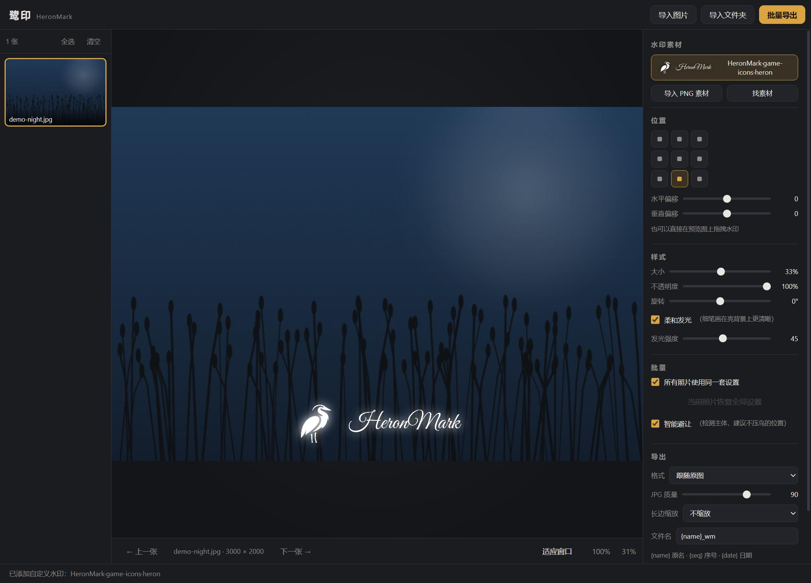

# 鹭印 HeronMark

**一个完全本地的批量照片签名水印工具。** 替代 Lightroom 的水印导出环节：导入照片、调好水印、批量导出，照片不离开你的电脑。

**A fully local batch photo watermarking tool, built for signature watermarks.** Import photos, place your watermark, batch-export — your photos never leave your machine.

by **SatoriAx**



---

## 下载 Download

到 [Releases](../../releases) 页面下载 `HeronMark-windows-x64.exe`：**单文件、免安装、双击即用**（Windows 10/11，64 位）。

Grab `HeronMark-windows-x64.exe` from [Releases](../../releases): single portable EXE, no installer, Windows 10/11 x64.

## 特性 Features

- **批量处理**：导入整个文件夹，统一或逐张调整水印位置，一次性导出
- **签名合成**：内置 7 款开源手写体（SIL OFL），输入名字实时预览，可搭配开源图标库的 30 万+ 图标合成"图标 + 签名"水印
- **智能避让**：本地 AI 主体检测（U2-Netp，离线运行），识别照片主体后建议不压主体的水印位置
- **所见即所得**：预览图直接拖拽水印，缩放平移查看细节，导出与预览严格一致
- **完全本地**：除「找素材」搜索图标库外不联网；无账号、无广告、无遥测

- **Batch**: import a whole folder, tune per-photo or globally, export in one pass
- **Signature composer**: 7 embedded open-licence script fonts (SIL OFL), live preview, optionally combine with 300k+ open-source icons (Iconify) into an "icon + signature" watermark
- **Smart avoidance**: on-device subject detection (U2-Netp, offline) suggests watermark positions that don't cover your subject
- **WYSIWYG**: drag the watermark right on the preview, zoom & pan to inspect, export matches preview pixel-for-pixel
- **Local-first**: no account, no ads, no telemetry; the only network call is the optional icon-library search

## 使用 Usage

1. 右上角导入照片或整个文件夹
2. 没有水印素材？点「找素材」：搜索图标、输入你的名字、挑字体、「合成并添加」
3. 九宫格选位置，或直接在水印上拖拽微调；大小、透明度、旋转、发光随意调
4. 「批量导出」，选择输出文件夹，完成

## 自行构建 Build from source

需要 Node.js 20+ 与 Rust 工具链（Windows 还需 Visual Studio Build Tools 的 C++ 工作负载）：

```bash
npm install
npx tauri build
```

产物在 `src-tauri/target/release/heronmark.exe`。网页版可直接 `cd app && python -m http.server` 打开（除文件系统访问外的功能在浏览器中同样可用）。

## 技术 Tech

- [Tauri 2](https://tauri.app)（Rust + 系统 WebView2，单文件约 15 MB）
- 前端为无框架原生 ES Modules + Canvas
- [ONNX Runtime Web](https://onnxruntime.ai/) + U2-Netp 做主体检测（模型已内嵌，离线推理）
- 图标来自 [Iconify](https://iconify.design/) 公共 API（免费、免 key）；图标版权归原作者所有，请注意各图标集的开源协议
- 内置字体：Great Vibes / Dancing Script / Caveat / Style Script / Sacramento / Allura / Pinyon Script（均 SIL OFL）

## License

[MIT](LICENSE) © SatoriAx

内置字体遵循各自的 SIL Open Font License；Iconify 图标集遵循各自协议（多数为 MIT / CC-BY / Apache）。
